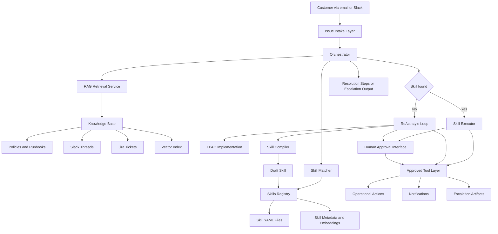

# Customer Issue Resolution Copilot — Component Diagram

This diagram gives a TA-friendly high-level view of the major system components and how they interact.

## Component Notes

- **Issue Intake Layer** receives mock customer issues from email or Slack.
- **Orchestrator** decides whether the issue can be handled by an existing skill or needs novel-task reasoning.
- **RAG Retrieval Service** grounds the system using company knowledge.
- **Skill Matcher** checks whether a reusable skill already exists.
- **ReAct-style Loop** is the recognizable reasoning pattern used for novel tasks.
- **TPAO Implementation** is the project-specific realization of the ReAct loop.
- **Human Approval Interface** ensures risky actions are reviewed before execution.
- **Skill Compiler** converts successful novel traces into reusable draft skills.