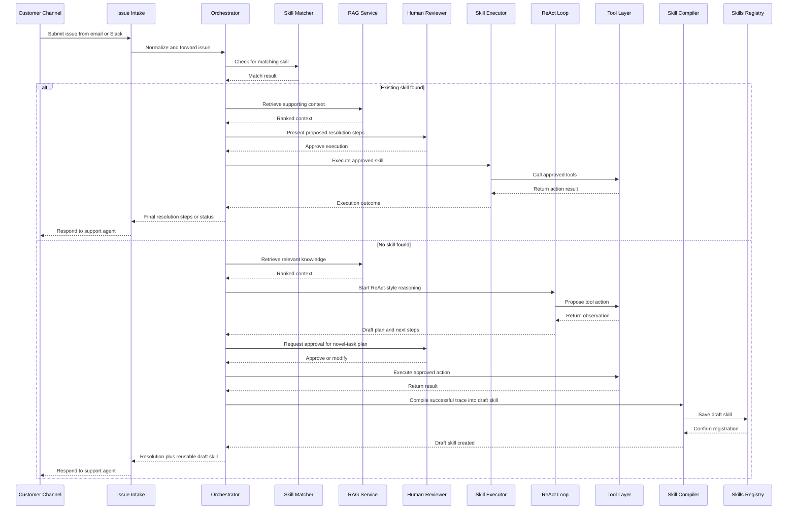

# Customer Issue Resolution Copilot — Sequence Diagram

This diagram shows the main end-to-end flow for resolving a customer issue.

## Sequence Notes

- The system first tries to reuse an existing skill before invoking novel-task reasoning.
- Retrieval is used in both paths so that actions and responses remain grounded in company knowledge.
- Human approval is required before consequential actions.
- The novel-task path creates a reusable draft skill, which is the core learning mechanism of the POC.