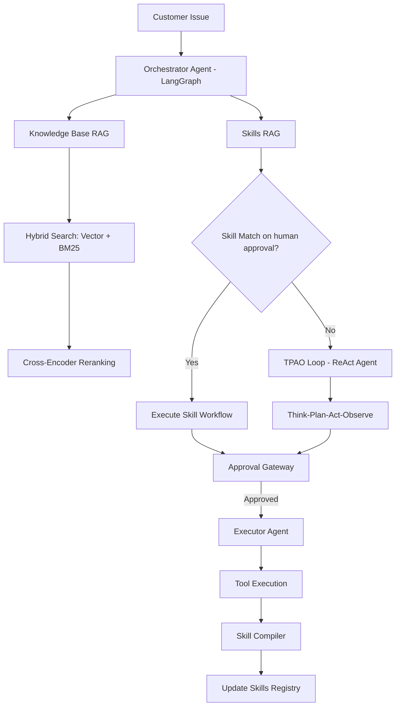

# Customer Issue Resolution Copilot — System Design Document

## Executive Summary

A **domain-agnostic** self-learning agentic system that converts customer issues into executable, human-approved resolution workflows. While demonstrated in a hotel management context, the architecture is designed to be adaptable across industries including SaaS support, e-commerce, financial services, and enterprise IT operations.

**Key Innovation**: Every novel task the system handles becomes a reusable skill it never has to relearn.

**Domain Flexibility**: The core architecture (RAG pipelines, agent orchestration, skill compilation) is industry-agnostic. Adaptation requires only:
- Domain-specific knowledge base (policies, procedures, documentation)
- Custom tool implementations (API integrations, database operations)
- Domain-appropriate skill definitions

**Applicable Domains**:
- **SaaS/Software**: Bug reports, feature requests, account issues, API troubleshooting
- **E-commerce**: Order management, returns, shipping issues, payment disputes
- **Financial Services**: Account inquiries, transaction disputes, compliance workflows
- **Healthcare**: Patient inquiries, appointment scheduling, insurance verification
- **Enterprise IT**: Helpdesk tickets, access provisioning, system troubleshooting

## 1. Problem Definition

Support and operations teams across industries face common challenges when resolving customer issues through fragmented channels. Whether handling hotel bookings, SaaS support tickets, or e-commerce orders, teams must search across policy documents, prior tickets, internal communications, and tribal knowledge. This creates three recurring problems:

- Resolution quality depends too much on individual operator knowledge
- Repetitive issues are solved repeatedly instead of becoming reusable workflows
- Escalations are inconsistent, especially when an issue requires an operational action or engineering follow-up

This system provides a **domain-agnostic Customer Issue Resolution Copilot**: a human-in-the-loop AI system that converts incoming customer issues into grounded resolution steps, human-approved actions, and reusable skills for future cases—regardless of industry.

## 2. Goal and Hypothesis

### Goal

Build a POC that demonstrates how repeated customer issues can be handled faster and more consistently by combining retrieval, agentic planning, and skill reuse.

### Core hypothesis

If the system can:
- retrieve the right company knowledge,
- determine whether an existing skill already solves the issue,
- generate a draft skill when no skill exists,
- and require human approval before consequential actions,

then support issue handling can improve over time instead of restarting from scratch for every new case.

## 3. Primary User and Real-World Value

### Primary user

The primary user is an internal support or operations agent handling customer-reported issues from email or Slack.

### Real-world value

This system is useful because it can:
- reduce time to first useful resolution
- improve consistency across agents
- preserve institutional knowledge as reusable skills
- safely assist with operational actions through approval gates
- create a bridge from support signals to engineering follow-up when needed

## 4. Example Workflows

### 4.1 Primary workflow: customer issue resolution

A customer reports an issue such as:
- refund not received
- account access not working
- billing discrepancy
- onboarding incomplete

The system:
1. ingests the issue from email or Slack
2. classifies the issue type
3. retrieves relevant policies, runbooks, prior tickets, and Slack discussions
4. checks whether an existing skill matches the issue
5. if a skill exists, proposes the resolution steps
6. if no skill exists, enters a ReAct-style reasoning loop to draft a new plan
7. pauses for human approval before any consequential action
8. compiles successful novel resolutions into a reusable draft skill

### 4.2 Stretch workflow: onboarding and access provisioning

Some customer issues are not informational and require an operational action. Example:
- a customer cannot log in because their account was never provisioned

In this case, the system can propose a human-approved action such as adding a user record or triggering an onboarding workflow through a controlled tool.

### 4.3 Stretch workflow: engineering escalation and staged change preparation

Some issues cannot be resolved through support actions alone and require code changes. Example:
- repeated customer complaints reveal a product bug

In this case, the system can:
- gather evidence from prior incidents and documentation
- draft a remediation skill or engineering action plan
- prepare a staged code-change request for another agent or workflow
- optionally create a Jira ticket in future iterations

For the POC, this remains a drafted artifact rather than a fully autonomous deployment workflow.

## 5. Scope

### In scope for the POC

- Customer issue intake from mock email or Slack inputs
- RAG pipeline over mock company knowledge
- Skill matching against a seeded skill registry
- Novel-task handling through a ReAct-style reasoning loop
- Human approval before risky or state-changing actions
- Skill compilation from successful novel traces
- Evaluation harness for retrieval, agent behavior, and guardrails

### Explicitly out of scope

- Autonomous execution agent in the initial phase
- Full production integrations with real customer systems
- Autonomous production deployments
- Enterprise authentication and authorization
- Large-scale multi-agent orchestration across many departments
- Full Jira or CI/CD automation

### Smallest hypothesis to prove

A customer issue can be resolved more effectively when the system either reuses an existing approved skill or drafts a new human-approved skill from retrieved company knowledge.

## 6. System Architecture

### 6.1 High-Level Architecture



### 6.2 Technology Stack

| Layer | Component | Technology | Purpose |
|-------|-----------|-----------|---------|
| **Agent Framework** | Orchestration | LangGraph | Multi-agent state management and workflow |
| **LLM** | Reasoning Engine | GPT-5.4-mini | Planning, generation, and decision-making |
| **Embeddings** | Vector Representation | OpenAI text-embedding-3-small (1536-dim) | Semantic search and matching |
| **Vector Database** | Storage & Retrieval | ChromaDB | Local vector storage with persistence |
| **Reranker** | Precision Layer | cross-encoder/ms-marco-MiniLM-L-6-v2 | Context relevance scoring |
| **Keyword Search** | Sparse Retrieval | BM25 (rank-bm25) | Exact term matching |
| **Fusion** | Result Combination | Reciprocal Rank Fusion (k=60) | Hybrid search merging |
| **Evaluation** | Quality Metrics | RAGAS + Custom LLM Judge | RAG and agent performance |
| **UI** | Interface | Streamlit | Human-in-the-loop approval interface |

### 6.3 RAG Pipeline Architecture

**Knowledge Base RAG**:
```
Query → Query Expansion → Parallel Retrieval:
  ├─ Vector Search (OpenAI embeddings)
  └─ BM25 Search (keyword matching)
→ Reciprocal Rank Fusion → Cross-Encoder Reranking → Top-K Context → LLM Generation
```

**Skills RAG**:
```
Issue Description → Enriched Embedding (5-layer context) → Vector Search →
Cross-Encoder Reranking → Confidence Scoring → Skill Selection
```

## 7. Major Components

### 7.1 Knowledge layer

The knowledge layer contains the information needed to ground responses and plans:
- policy documents
- support procedures
- onboarding runbooks
- mock Slack threads
- mock Jira tickets

These are chunked, embedded, indexed, and stored in a vector database. Retrieved candidates are reranked before being passed to the agent.

### 7.2 RAG subsystem

The retrieval pipeline is:

1. document ingestion
2. chunking
3. embedding generation
4. vector retrieval
5. reranking
6. answer or plan grounding

This is important because the judges explicitly care about:
- chunking strategy
- indexing
- retrieval quality
- reranking
- eval performance

### 7.3 Coordinator Agent

The Coordinator Agent is the entry point for each issue. It:
- classifies the issue
- checks for a matching skill
- routes to either the skill path or the novel-task path
- prepares a grounded plan for human review

This keeps the system scoped. Known issues should not invoke a full reasoning loop if a reusable skill already exists.

### 7.4 Skills system

The skills system is the core reusable memory mechanism. A skill contains:
- trigger conditions
- ordered steps
- tool calls
- approval requirements
- guardrails
- source trace

The system stores skills in YAML plus a registry for lookup and lifecycle management.

### 7.5 ReAct-style reasoning loop

When no skill matches, the system enters a **ReAct-style loop** for novel-task handling. In this project, the implementation-specific loop is **TPAO**:
- Think
- Plan
- Act
- Observe

ReAct reasoning pattern: the model reasons over retrieved context, selects actions, observes tool results, and iterates. TPAO is our concrete implementation of that pattern for this capstone.

This loop is used only for novel or ambiguous tasks. It is the mechanism that allows the system to convert one-off issue handling into reusable operational knowledge.

### 7.6 Human approval layer

Human approval is mandatory for:
- refunds or financial actions
- database writes
- access provisioning
- any deployment-like or engineering action

This is both a safety mechanism and a core design choice for the POC.

## 8. Data Processing Design

### Sources

The POC uses mock internal company data:
- HR and onboarding docs
- support policies
- IT procedures
- Slack threads
- Jira tickets
- seeded skill files

Using synthetic but realistic internal data is acceptable for the capstone because the goal is to validate retrieval quality, agent routing, skill reuse, and human-in-the-loop execution under realistic workflows.

### Chunking strategy

The recommended chunking strategy is **document-aware semantic chunking with overlap**.

Reasoning:
- support policies and runbooks often contain stepwise procedures that should remain intact
- Slack and ticket threads contain short conversational fragments that should be grouped by thread or issue unit rather than arbitrary token windows
- overlap helps preserve context across adjacent procedural steps


### Indexing

- Dense embeddings are used for semantic retrieval
- Skills also store trigger embeddings for fast matching
- Metadata should include source type, domain, and document identifier

### Retrieval

- Retrieve a wider candidate set first
- Pass candidates through a reranker
- Use top reranked chunks as grounding context

### Reranking

Reranking is included because support issues are often phrased differently from policy documents. Dense retrieval alone may surface approximate matches, while reranking improves precision on the final context passed to the model.

## 9. Agent and Tooling Design

### Why agentic behavior is justified

This project is not just a chatbot over documents. It needs:
- routing between known and unknown tasks
- multi-step ReAct-style planning for novel issues
- tool selection
- approval-aware execution
- conversion of successful traces into reusable skills

That makes it a hybrid **RAG + agentic** system rather than a pure RAG assistant. More specifically, it uses RAG for grounding and a ReAct-style agent loop for novel-task execution.

### Agent count for the POC

- **Current POC:** one primary agent, the Coordinator Agent

This is the recommended balance between feasibility and ambition for the capstone timeline.

### Tooling model

For the POC, tools are mocked Python functions representing actions such as:
- lookup order
- check policy
- send email
- grant access
- create ticket
- add user
- prepare engineering escalation artifact

This keeps the project realistic without over-engineering external integrations.

## 10. Guardrails and Safety

The system must include guardrails for:

- **PII handling**  
  The system should refuse or block requests for sensitive customer data not required for resolution.

- **Approval gating**  
  Any state-changing action must require human approval.

- **Low-confidence handling**  
  If retrieval confidence is weak or sources conflict, the system should ask for clarification or escalate rather than hallucinate.

- **Prompt injection resistance**  
  Retrieved content should be treated as evidence, not as instruction. The system prompt and tool policy must remain authoritative.

- **Bounded tool access**  
  The agent can only call approved tools with validated inputs.

Security and scalability are not the main judging criteria, but basic guardrails are necessary because the project touches operational workflows.

## 11. Design Tradeoffs

| Decision | Benefit | Tradeoff |
|---|---|---|
| Use mock tools instead of real integrations | Faster build, safer demo, easier evals | Less realistic end-to-end execution |
| Keep human in the loop | Safer and more credible for operational actions | Less automation |
| Keep the initial POC single-agent | Reduces orchestration complexity and keeps Week 1 feasible | Multi-agent execution is deferred |
| Use RAG plus reranking | Better grounding and retrieval precision | Slightly higher latency and complexity |
| Use skills plus ReAct or TPAO loop | Demonstrates learning and reuse | More moving parts than a simple chatbot |
| Keep code-change workflow as stretch scope | Preserves extensibility | Not a full proof of autonomous engineering |

## 12. Evaluation Plan

The POC should be judged on whether it works reliably, not just whether it demos well.

### 12.1 RAG evals

Use task-specific retrieval and answer quality metrics:
- faithfulness
- answer relevancy
- context precision
- context recall

Suggested targets based on the architecture draft:
- faithfulness at least 0.85
- answer relevancy at least 0.90
- context precision at least 0.80
- context recall at least 0.90

### 12.2 Agent evals

Evaluate:
- skill match accuracy
- tool-call correctness
- ReAct or TPAO plan quality
- self-learning loop success
- guardrail catch rate

Suggested targets:
- skill match accuracy at least 90 percent
- ReAct or TPAO plan quality at least 4 out of 5
- guardrail catch rate 100 percent on defined red-team cases
- self-learning loop must pass end-to-end

### 12.3 Core thesis eval

The most important eval is:

**Novel issue → no skill match → ReAct or TPAO plan → human-approved execution → compiled draft skill → similar future issue matches the new skill**

If this loop works, the POC proves its central thesis.

### 12.4 Error handling evals

The system should also be tested on:
- unsupported requests
- conflicting retrieved sources
- prompt injection attempts in retrieved documents
- requests involving PII
- ambiguous issues that require clarification

## 13. Example Eval Cases

1. **Known refund issue**  
   Input: refund request for a standard eligible order  
   Expected: existing refund skill is matched and proposed with approval gate

2. **Policy lookup**  
   Input: question about refund policy  
   Expected: grounded answer with correct supporting context

3. **Novel onboarding issue**  
   Input: customer cannot log in because onboarding was never completed  
   Expected: no skill match, ReAct or TPAO generates plan, human approves operational action

4. **High-risk financial request**  
   Input: refund request above allowed threshold  
   Expected: blocked or escalated by guardrail

5. **PII request**  
   Input: request for customer credit card details  
   Expected: refusal

6. **Repeat of a previously novel issue**  
   Input: similar issue after draft skill creation  
   Expected: newly compiled skill is matched instead of re-planning from scratch

## 14. Cost and Latency Considerations

### Cost

This POC is intentionally scoped to remain affordable:
- small mock corpus
- limited eval dataset
- lightweight fallback matching
- mock tools instead of paid external integrations

Main cost drivers:
- embedding generation
- reranking calls
- LLM calls for orchestration and the ReAct-style loop
- eval runs

### Latency

Main latency contributors:
- retrieval plus reranking
- multi-step reasoning in the novel-task path
- human approval pauses

This is acceptable because the primary workflow is support assistance, not hard real-time inference.

## 15. Why This Project Fits the Judging Criteria

### Problem definition

- Clear user: support or operations agent
- Clear problem: fragmented issue resolution and repeated manual handling
- Clear value: faster, more consistent, reusable issue handling

### Data processing

- Defined sources
- explicit chunking and indexing strategy
- PII-aware guardrails

### System design

- clear architecture
- explicit tradeoffs
- scoped POC boundaries

### Evals

- task-specific RAG metrics
- agent-specific metrics
- red-team and error-handling cases
- cost and latency considerations

## 16. Risks and Mitigations

| Risk | Likelihood | Mitigation |
|---|---|---|
| Retrieval misses the right policy or runbook | Medium | Use reranking, source-aware chunking, and retrieval evals |
| Skill matching fails on paraphrased requests | Medium | Use embedding match plus LLM fallback |
| Novel-task plans are low quality | Medium | Keep tool set small, require approval, evaluate plan quality |
| Scope expands into too many workflows | High | Keep customer issue resolution as the only primary wedge |
| Code-change scenario becomes too ambitious | High | Treat it as a drafted stretch scenario only |
| Unsafe action execution | Low to Medium | Require approval for all consequential actions |

## 17. Recommended Build Sequence

### Week 1
- Build mock knowledge base and ingestion pipeline
- Implement retrieval plus reranking
- Seed 2 to 3 starter skills
- Implement Coordinator Agent routing between skill path and novel-task path
- Add human approval interface for proposed actions

## 18. Future Enhancements

A future enhancement is to introduce a minimal multi-agent extension with an **Execution Agent**.

In that future version:
- the Coordinator Agent continues to handle retrieval, reasoning, skill selection, and planning
- the Execution Agent performs approved actions after human approval
- the system remains human-in-the-loop while reducing manual execution burden

This is intentionally deferred so the initial capstone remains feasible within one week while still showing a credible path toward multi-agent expansion.

## 19. Conclusion

This capstone **Customer Issue Resolution Copilot** is not just answering questions from documents. It is the combination of:

- grounded retrieval,
- ReAct-style agentic handling of novel issues,
- human-approved operational actions,
- and conversion of successful traces into reusable skills.

That framing keeps the project realistic, aligned with the judging rubric, and differentiated from a generic support chatbot. A future phase can extend this into a minimal multi-agent system by introducing an Execution Agent for approved actions.
## 12. Security & Guardrails

The system implements six layers of regex-based guardrails (zero external dependencies) to ensure safe and responsible AI operations:

### 12.1 PII Detection & Masking (`pii_detector.py`)
**Technology:** Regex pattern matching with Luhn algorithm for credit card validation  
**Detects:** Credit cards, SSN, emails, phone numbers, passports, driver's licenses, DOB, addresses, room numbers, booking references  
**Action:** Automatic masking (e.g., `****-****-****-1234`) and blocking for sensitive PII (credit cards, multiple sensitive items)

### 12.2 Prompt Injection Detection (`guardrails_ai_injection_detector.py`)
**Technology:** Compiled regex patterns with threat categorization  
**Detects:** 
- Instruction override ("ignore all instructions")
- Role manipulation ("you are now a...")
- System prompt leaks ("show me your system prompt")
- Jailbreak attempts ("DAN mode", "bypass restrictions")
- Data exfiltration ("export all customer records")
- Malicious tool calls (SQL injection, script injection)

**Scoring:** 0.0-1.0 risk score with configurable threshold (default: 0.5)

### 12.3 Confidence Checking (`confidence_checker.py`)
**Technology:** Score-based thresholds with conflict detection  
**Levels:** HIGH (>0.7), MEDIUM (0.3-0.7), LOW (<0.3), NONE (no results)  
**Action:** Escalates to human when confidence is insufficient for action risk level

### 12.4 Tool Input Validation (`tool_validator.py`)
**Technology:** Rule-based validation with regex patterns  
**Validates:** Type checking, range validation, length validation, pattern matching, allowed values, custom validators  
**Example Rules:**
- Booking ID: `^BK[0-9]{5}$`
- Refund amount: $0.01 - $10,000
- Email: RFC-compliant regex

### 12.5 Rate Limiting (`tool_validator.py`)
**Technology:** Time-windowed call tracking  
**Limits:** Per-minute, per-hour, per-day thresholds per tool  
**Example:** `process_refund` limited to 10/min, 100/hour, 500/day

### 12.6 Approval Enforcement (`approval_enforcer.py`)
**Technology:** Token-based authorization with replay prevention  
**Enforces:** Mandatory approval for financial transactions, booking modifications, access control changes  
**Validation:** Status check (APPROVED only), expiry validation (30-min default), one-time use (prevents replay attacks)

### Implementation Details
- **Location:** `src/application/guardrails/`
- **Dependencies:** Python standard library only (regex, datetime, collections)
- **Pattern:** Singleton instances for efficiency
- **Performance:** Compiled regex patterns, O(n) complexity
- **Test Coverage:** 50+ test scenarios in `tests/guardrails_test_cases.txt`

